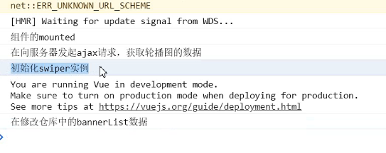

[TOC]

# 尚品汇-前台项目--基于Vue2

```
1:尚品汇源码Gitee地址
https://gitee.com/jch1011/shangpinhui_0415.git
2：后台管理系统源码Gitee地址
https://gitee.com/jch1011/guigu.git
```

 + 仓库中复杂数据的读取使用getters简化，注意异步请求数据数据为undefined的问题，  解决： || []
   + 对用户的输入格外的小心，必须在传输据前对用户的数据进行校验-- **数据格式是否合法** **数据范围是否合法** **数据如果不合适要适当纠正，比如需要整数，用户输入带小数的数据，就要用parseInt**
   + 一定要注意在发请求时，后端需要的数据格式，比如购物车页面的isCheck
   + 注意 **return** 的问题

## 路由跳转与传参相关问题

```js
gosearch() {
    // (1)路由传参
    this.$router.push('/search/' + this.keyword +
                      "?k=" + this.keyword.toUpperCase())
    // (2)模板字符串 路由传参  ``用Tab上面的键打出来
    this.$router.push(`search/${this.keyword}?k=${this.keyword.toUpperCase()}`)
    // 面试题：：：解决对于params参数可传可不传时路径异常（search路径丢失）的问题，
    this.$router.push({name:"search",params:{keyword:"" || undefined},query:{k:this.keyword.toUpperCase()}})
    // 面试题------params不可以和path一起使用
    this.$router.push({path:'/search',params:{keyword:this.keyword},
                       query:{k:this.keyword.toUpperCase()}})
    // 路由可不以传递props参数--------可以，但是只可以传递props参数
    // (3)对象传参------常用
    // this.$router.query即使没有也是个{}，可以执行if内的语句
    if (this.$route.query) {
        //判断是否有query参数，将query参数和params都push过去
        let location = {
            name: "search",
            params: { keyword: this.keyword || undefined },
        };
        location.query = this.$route.query;
        this.$router.push(location);
    }
},
```

1. 跳转路由的 2 种基本方式
   声明式: <router-link to="">
   编程式: **this.$router.push()/replace()**

2. 跳转路由携带参数的 2 种方式
   **params** 参数
   **query** 参数

3. 面试问题 1: 
   描述: 编程式路由跳转到当前路由(参数不变), 会抛出 **NavigationDuplicated** 的警告错误
   解决 1: 在跳转时指定成功或失败的回调函数, 通过 catch 处理错误
   解决 2: 修正 Vue 原型上的 push 和 replace 方法 (优秀)

4. 面试问题 2: 如何指定 params 参数可传可不传? 
   **path: '/search/:keyword?'**

5. 面试问题 3: 指定 params 参数时可不可以用 path 和 params 配置的组合?
   不可以用 path 和 params 配置的组合, 只能用 name 和 params 配置的组合
   query 配置可以与 path 或 name 进行组合使用

6. 面试问题 4: 如果指定 name 与 params 配置, 但 params 中数据是一个"", 无法跳转
   解决 1: 不指定 params
   解决 2: 指定 params 参数值为 undefined

   ```js
   params: { keyword: this.keyword || undefined },
   ```

   

7. 面试问题 5: 路由组件能不能传递 props 数据?
   可以: 可以将 query 或且 params 参数映射/转换成 props 传递给路由组件对象
   实现: props: (route)=>({keyword1:route.params.keyword, keyword2: route.query.keyword })

### 路由元信息

路由元信息来控制footer的显示与否

```js
{
    name:"search",
    path:"/search/:keyword?",    //加上？,则params参数可传可不传
    component:Search,
    meta:{show:true},
    //路由可不以传递props参数?
    // props:true,
    //还可以用props:{a:1,b:2}的形式给组件传递信息
    //不过最常用的是函数形式
    props:($route)=>{
    	return {keyword:$route.params.keyword,k:$route.query.k};
    }
},
```


### 解决路由跳转时的 NavigationDuplicated 错误


**问题**:  编程式路由跳转到当前路径且参数没有变化时会抛出 NavigationDuplicated 错误 

**原因分析**:  vue-router3.1.0之后, 引入了push()的promise的语法, 如果没有通过参数指定回调函数就返回一个 promise 来指定成功/失败的回调, 且内部会判断如果要跳转的路径和参数 都没有变化, 会抛出一个失败的 promise

```js
//1) 问题:编程式路由跳转到当前路径且参数没有变化时会抛出 NavigationDuplicated 错误
//2) 原因分析:vue-router3.1.0之后, 引入了push()的promise的语法, 如果没有通过参数指定回调
//函数就返回一个 promise 来指定成功/失败的回调, 且内部会判断如果要跳转的路径和参数
//都没有变化, 会抛出一个失败的 promise

// 缓存原型上的 push 函数
const originPush = VueRouter.prototype.push
const originReplace = VueRouter.prototype.replace
// 给原型对象上的 push 指定新函数函数
VueRouter.prototype.push = function (location, onComplete, onAbort) {
 // 判断如果没有指定回调函数, 通过 call 调用源函数并使用 catch 来处理错误
 if (onComplete===undefined && onAbort===undefined) {
 return originPush.call(this, location, onComplete, onAbort).catch(() => {})
 } else { // 如果有指定任意回调函数, 通过 call 调用源 push 函数处理
 originPush.call(this, location, onComplete, onAbort)
 }
}
VueRouter.prototype.replace = function (location, onComplete, onAbort) {
 if (onComplete===undefined && onAbort===undefined) {
 return originReplace.call(this, location, onComplete, onAbort).catch(() =>
{})
 } else {
 originReplace.call(this, location, onComplete, onAbort)
 }
}
```

其实就是判断用户有没有制定Promise失败或者成功回调，没有我给他补上


### 路由鉴权

- 全局路由守卫
- 独享路由守卫
- 组件路由守卫

## 二次封装Axios

一般来说，在项目中/api文件夹下，有个文件专门用于二次封装Axios。还有一个文件。一般来说是`index.js`，用于统一管理接口api,所有的请求操作都放在该文件夹

可以搭配`nProgress`使用，注意引入**nProgress**的样式，该样式是可以修改的

```js
//对axios二次封装
import axios from "axios";
import nProgress from "nprogress";
import "nprogress/nprogress.css";


const requests = axios.create({
    baseURL:"/api",
    timeout:5000,
    // data:{GameName:"随风"}
});

requests.interceptors.request.use((config)=>{
    nProgress.start();
    return config;
});

requests.interceptors.response.use((res)=>{
    nProgress.done();
    return res.data;
},(error)=>{
    return Promise.reject(new Error('falie'));
});

export default requests;
```

## Vue的配置代理

jsonp  cros  代理跨域

`vue.config.js`

```js
devServer: {
    proxy: {
        '/api': { // 只对请求路由以/api 开头的请求进行代理转发
            target: 'http://182.92.128.115', // 转发的目标 url
            changeOrigin: true // 支持跨域
        }
    }
},
```

## 使用Vuex模块化开发

各个模块其实就主要：

```js
export default {
    state,
    mutations,
    actions,
    getters
};
```

也不涉及什么Api

- state的数据初始格式注意和后端返回的数据保持统一
- actions不进行数据的更改，但是可以进行异步操作，向后端请求数据，通过`this.commit('GETSEARCHLIST',result.data)`通知mutations
- mutations负责更改state
- getters简化数据的读取

疑惑

```js
const actions = {
    async getSearchList({commit},params){
        let result = await reqGetSearchInfo(params);
        if(result.code == 200){
            this.commit('GETSEARCHLIST',result.data);
        }
    }
};
```

**原因**：
在Vue.js的`actions`中，`{commit}` 是通过ES6的解构赋值语法从`context`中提取`commit`方法。`context`是一个包含了`commit`、`dispatch`等方法的对象，但你可以只提取你需要的方法，这样可以简化代码并提高可读性。

在你的例子中，`getSearchList`是一个异步action，`commit`是用于触发mutation的方法。通过解构赋值，你直接从`context`中提取了`commit`方法，而不需要使用`context.commit`。

所以，这个写法是为了方便在`getSearchList`中直接调用`commit`方法，而不需要每次都写`context.commit`。这样的写法更为简洁，也更容易理解和维护。


在`./store/indedx.js`文件中引入时。模块化开发就只需要由**modules**

```js
import Vue from 'vue';
import Vuex from 'vuex';

Vue.use(Vuex);

import home from './home';
import search from './search';
import terraria from './terraria';
export default new Vuex.Store({
    modules:{
        home,
        search,
        terraria
    }
})
```


### 命名空间namespace的作用及好处


## home页搭建

### 整体结构

- TypeNav: 3 级分类导航
- ListContainer: 包含轮播列表的容器
- TodayRecommend: 今日推荐
- Rank: 排行
- Like: 猜你喜欢
- Floor: 楼层
- Brand: 品牌

### TypeNav

重难点说明

1) 组件与 vuex 交互
2) 事件控制二三级分类列表的显示与隐藏
3) 优化高频事件触发处理: 利用 lodash 进行函数节流处理
4) 优化减小打包文件: 对 lodash 库实现按需引入
5) 解决快速移出后可能显示第一个分类的子分类列表的 bug
6) 优化减少组件对象数量: 使用编程式导航代替声明式导航
7) 优化事件处理效率: 利用**事件委托**
8) 利用标签自定义属性携带动态数据
9) 控制一级列表的显示与隐藏
10) 一级列表显示隐藏的过渡效果
11) 优化请求执行的位置, 减少请求次数
12) 合并分类 query 参数与搜索的关键字 params 参数


mapState读取仓库state

```js
computed: {
    ...mapState({
        categoryList: (state) => {
            return state.home.categoryList;
        },
    }),
},
```

`tips`	读取getter:    `$store.getters.bigSum`


#### 事件控制二三级分类列表的显示与隐藏

​	+事件委派

​	+节流防抖

​	+合并路由参数

​	+Vue过渡及动画

因为这是一个三级列表，借助`v-for`实现，所以在一级分类标签中引入mouseenter，在该时间中同步**currentIndex**，该值的初始值为index取不到的数即可，通过`:class="{ cur: currentIndex == index }"`控制鼠标移入的高亮，同时二三级分类列表的显示与隐藏也是通过该属性实现的：`:style="{ display: currentIndex == index ? 'block' : 'none' }"`

上述实现了显示，对于隐藏，使用mouseleave，将**currentIndex**置为index取不到的数即可，但是因为业务的关系，这里需要用到事件委派，将该操作交给其父元素


但是这里目前的问题是，有时候用户操作太快，就不是很好，所以需要加上节流防抖

- 节流 规定时间只触发一次
- 防抖 频繁触发只会触一次，前面的都会取消

使用**lodash**

```js
import throttle from "lodash/throttle.js";

// 这里使用ES的写法
changeIndex: throttle(function (index) {
	this.currentIndex = index;
}, 50),
```

#### 三级分类列表的路由跳转方式

对于这个问题，可以对每个a标签使用<router-link>来完成该逻辑，但是<router-link>作为一个组件，这代表着将要在页面上挂载成百上千个Vue实例对象，这肯定会造成很大的负载，所以这里采取事件委派+编程式路由导航+自定义属性完成业务

给与一级列表父容器点击事件，这里使用**HTMLElement.dataset**，同时赋予一二三级分类标签自定义属性`category1id, category2id, category3id`

**关于dataset**

- [`HTMLElement`](https://developer.mozilla.org/zh-CN/docs/Web/API/HTMLElement) 接口的只读属性 **`dataset`** 提供了对元素上[自定义数据属性](https://developer.mozilla.org/zh-CN/docs/Web/HTML/Global_attributes/data-*)（`data-*`）读/写访问。它暴露了一个字符串映射（[`DOMStringMap`](https://developer.mozilla.org/zh-CN/docs/Web/API/DOMStringMap)），其中包含每个 `data-*` 属性条目。

- 为什么明明自定义属性名为data-categoryName的形式，但是可以通过下述方式解构出来

  ```js
  const { categoryname, category1id, category2id, category3id } = event.target.dataset;
  ```

  这是因为在DOM中，`dataset` 对象的属性名会自动将短横线形式转换为驼峰命名法。这是一种规范化的行为，旨在使JavaScript中的属性名更符合通用的驼峰命名规范。

  在HTML中，我们可以使用短横线分隔的形式，如 `data-category-name`。然而，当我们在JavaScript中使用 `dataset` 获取属性时，属性名会被转换为驼峰命名法。例如：

  ```js
  javascriptCopy codeconst element = document.getElementById('yourElementId');
  console.log(element.dataset.categoryName); // 这里是驼峰命名法
  ```

  因此，虽然在HTML中使用了 `data-categoryName`，但在JavaScript中，你使用 `dataset` 时应该使用 `categoryName` 而不是 `data-categoryName`。

  这个转换是自动进行的，无需手动添加 `data-` 前缀。Vue.js在处理这些自定义属性时会遵循相同的规则。这种设计有助于使JavaScript代码更符合通用的命名约定。

当点击事件触发时，解构出

```js
const { categoryname, category1id, category2id, category3id } = event.target.dataset;
```

如果有`categoryname`有值，显然点击的是`a`标签，因为只有a标签才被赋予了自定义属性，所以通过这样，点击事件可以获取点击的是哪个a标签，再将需要的值赋予自定义属性

```js
if (categoryname) {
    // console.log(categoryname);
    var location = { name: "search" };
    var query = { categoryName: categoryname };
    if (category1id) {
        // console.log(category1id);
        query.category1Id = category1id;
    } else if (category2id) {
        query.category2Id = category2id;
    } else if (category3id) {
        query.category3Id = category3id;
    }
}
```

至此，即可完成query参数的收集

#### 合并params,query参数

三级分类携带的是query参数，Header组件的搜索栏携带的是params参数，现在的问题是，点击这两个无论哪个，另外一个的内容都为空，也就是就是携带不上，这里只需要在路由跳转时，带上相应的参数即可

三级分类带上params:

```js
//判断是否有params参数，将query参数和params都push过去
if(this.$route.params){
	location.params = this.$route.params;
}
```

Header组件带上query：

```js
// this.$router.query即使没有也是个{}，可以执行if内的语句
if (this.$route.query) {
    console.log(this.$route.query);
    //判断是否有query参数，将query参数和params都push过去
    let location = {
        name: "search",
        params: { keyword: this.keyword || undefined },
    };
    location.query = this.$route.query;
    this.$router.push(location);
}
```

- this.$router.query即使没有也是个{}，可以执行if内的语句

### swiper

#### 遇到的一些问题

swiper要求必须先有结构，再new实例

遇到的问题是： 组件还没有数据，结构不完整（这时的项目进度是在组件自身派发action）



修改仓库数据之后才有数据，在此之前初始化swiper实例是一定不行的

- mounted之后，html结构不一定完整，如果结构是根据数据动态生成的，而数据是向服务器异步获取的，就可能出现mounted后，结构并不一定完整
- 使用watch + this.$nextick解决
- **this.$nextick**：在下次DOM更新循环结束之后执行延迟回调。在修改数据之后立即使用这个方法，获取更新后的 DOM。
- 为什么需要`this.$nextick`, 即使监听到`list`发生变化，也就是有数据了，但是`v-for`遍历也是需要时间的，页面还是不一定有结构，所以使用this.$nextick保证在下次dom更新后页面一定有结构
- 即使封装该组件，数据由父组件通过props传过来，也就是该有的数据都有，但是还是需要**this.$nextick**，因为v-for动态渲染结构我们还是没有办法确定的，因此还是需要用nextTick，而且需要`immediate:true`，因为watch监听不到List的变化：因为这个数据从来没有发生变化（数据是父亲给的，父亲给的时候就是一个对象，对象里面该有的数据都是有的

```js
  watch:{
    list: {
      //监听不到List的属性，因为是Home父组件传过来的，
      // Vue: 但是没关系，就当时为了我，对他使用immediate：TRUE吧，上来立即监听一次
      //道理同Listcontainer一样，需要使用nextTick属性
      //this.$refs.mySwiper =>  ".swiper-container"
      immediate:true,
      handler(){
        this.$nextTick(()=>{
            var mySwiper = new Swiper(".swiper-container", {
            direction: "horizontal", // 垂直切换选项
            loop: true, // 循环模式选项
            .......
          });
        })
      }
    }
  }
```


## Mock--本地模拟接口

- `npm i mockjs`

- 服务器返回的Json字符串`src/mock/banners.json`，该文件里如果链接了静态资源，图片之类的，将图片放在`/public`下，

- `src/mock/mockServer.json`:

  ```js
  //webpack默认对外暴露的有JSON数据格式，图片
  import Mock from 'mockjs'
  import banners from './banners.json'
  import floors from './floors.json'
  
  Mock.mock("/mock/banners",{code:200,data:banners});
  Mock.mock("/mock/floors",{code:200,data:floors});
  ```

  该文件至少要执行一次，所以在`main.js`中: 

  ```js
  //引入MockServer.js  ----mock数据
  import '@/mock/mockServer'
  ```

- 剩下的就是请求，向`/mock/banners`请求，发出的Ajax会被在本地拦截，


## search页面搭建

首先，search页面数据如下，代表了当前搜索相关的信息，所以在改页面的操作必须密切关注其改变或者对其操作：

```js
  data() {
    return {
      searchParams: {
        category1Id: "",
        category2Id: "",
        category3Id: "",
        categoryName: "",
        keyword: "",
        //初始状态：综合:降序
        order: "1:desc",
        pageNo: 1,
        pageSize: 3,
        props: [],
        trademark: "",
      },
    };
  },
```


### 解决header搜索栏失效

- search页面如果由home跳转，那么应该要基于其携带的路由参数获得要展示的数据

- 可以选择在组件挂载阶段派发异步action获取数据，但是因为后面肯定还要不断地更新搜索页面，所以这里，我们将派发异步action获取数据的操作包装到methods的**getdata**,在mounted阶段调用，完成初次渲染

- 上一步还需要注意的是，在beforeMount阶段合并路由参数

  ```js
  beforeMount() {
      Object.assign(this.searchParams, this.$route.query, this.$route.params);
  },
  ```


- 合并参数至 **searchParams** 后，在 **mounted** 调用 **getdata** 派发 **action** 即可

- 但是这里导致的问题是，后续再次在Header组件搜索是不再次派发异步action获取数据的，因为，组件只会在mounted阶段执行getdata，header再次搜索仅仅只会改变路由信息，而不会触发getdata方法

- 其实很简单，只需要将$route作为监听属性即可，当$$route信息发生变化，带着路由信息并且调用getdata方法重新派发异步action获取数据即可

  **注意合并路由信息**

  ```js
  Object.assign(this.searchParams, this.$route.query, this.$route.params);
  ```

  注意在更新页面后清除三级分类列表的数据，这三个每次都只会有一个有值，所以不清除就会出现同时有两个，三个有值，categoryName不用，他就一个，每次都会替换

**总结**	beforeMount阶段合并路由参数 => 在mounted阶段调用getdata，完成初次渲染

​	 => 将$route作为监听属性即可，当$$route信息发生变化，带着路由信息并且调用getdata

### 展示数据

- Vuex的getter是不分模块的，以数组形式调用即可

  ```js
  computed:{
      ...mapGetters(['trademarkList','attrsList'])
  },
  ```

  

### 面包屑清除操作

- 每一次去除都要重新发送请求获取数据

- 有的属性位于子组件--品牌信息，用到了自定义事件

  - 父组件给子组件自定义事件

    ```vue
    <SearchSelector @trademarkInfo="trademarkInfo" @attrInfo="attrInfo" />
    
    trademarkInfo(trademark) {
        this.searchParams.trademark = `${trademark.tmId}:${trademark.tmName}`;
        this.getdata();
    }
    ```

  - 子组件触发并携带数据

    ```js
    attrHandler(attr,attrvalue){
        this.$emit('attrInfo',attr,attrvalue)
    }
    ```

    

- header组件的搜索内容也作为面包屑--keyword，清除该条信息时，显然也要将header搜索栏的文字置空，这里使用了全局事件总线，注意，自定义事件不在标签中写则应该在mounted阶段发布事件

  - 需要数据的地方派发事件

  ```js
  this.$bus.$on('clearkeyword',()=>{
      this.keyword = "";
  })
  ```

  - 需要更改数据的时候触发即可

  ```js
  this.$bus.$emit("clearkeyword");
  ```

  

- 移除categoryName时有个小细节

  - 发送数据和清除面包屑前：

    ```js
    //即使为空''，请求依旧会携带空字符串，设置为undefined，则不会携带过去,提升性能
    this.searchParams.categoryName = undefined;
    this.searchParams.category1Id = undefined;
    this.searchParams.category2Id = undefined;
    this.searchParams.category3Id = undefined;
    ```

  - 发送数据和清除面包屑后更新路由信息，

    ```
    this.getdata();
    ```

    显然只有与三级分类和搜索栏相关的才需要该操作，移除其他面包屑只需要将对应属性置为undefined即可

    **注意因为有params和query,清除一个，不要忘记将另外一个遗漏，这一步不可以遗漏**

    ```js
    if (this.$route.params) {
        this.$router.push({ name: "search", params: this.$route.params });
    }
    ```

    **遗漏的后果(这里展示的是去除三级列表面包屑后应该只携带params的逻辑)：**

    

    **下面是正确的跳转结果(应该只携带params才对)：**
    

- props是一个数组，代表商品参数，信息由v-for遍历生成面包屑结构，添加时，需要去重

  

  ```js
  //组合标签属性获取
  attrInfo(attr, attrvalue) {
          let props = `${attr.attrId}:${attrvalue}:${attr.attrName}`;
          //去重，不然一直往里加 ,等于-1表示不重复
          if(this.searchParams.props.indexOf(props) == -1 ){
          this.searchParams.props.push(props);
      }
      this.getdata();
  },
  ```

  删除：**this.searchParams.props.splice(index,1);**


### 排序业务的完成

参数： 1:desc   1代表综合 desc代表降序


- icon组件库的使用
- 总共就两个按钮，点击事件绑定相同的函数，通过传入的参数不同判断点击的是综合还是价格，判断之后，对于本身已是筛选条件的按钮的再次点击，显然是将原有的升序降序取反即可，点击不同按钮，将数字取另一个，排序默认降序即可

```js
if (flag == orginsFlag) {
    newOrder = `${orginsFlag}:${originSort == "desc" ? "asc" : "desc"}`;
} else {
    //点击不是同一个按钮
    newOrder = `${flag}:${"desc"}`;
}
```


### 重要--手写分页器组件

- 前端三大件:轮播图、分页、日历。这属于前端开发常见三种业务

- 为什么很多项目中都采用分页功能?

  - 比如电商平台：搜索一个奶粉，奶粉的产品有10000+，一次渲染10000+条数据，可能慢。

    数据多的时候，可以选择分页，比如每一次只是展示10


- 拆分分页组件（静态组件），注册为全局组件，因为其他模块也在使用分页功能。

- 分页器组件需要知道我一共展示多少条数据 ----total【100条数据】

- 每一个需要展示几条数据------pageSize【每一页3条数据】

- 需要知道当前在第几页-------pageNo[当前在第几页]

- 需要知道连续页码数【起始数字、结束数字：连续页码数市场当中一般5、7、9】奇数，对称好看 continues


这里我们要计算两个数据continues的start和end,

分页器的逻辑先考虑可能出现的情况

- **if (continues > totalPage)** 总页数比较少，continues的连续页码数比总页数还多，这显然start就是1，end就是totalPage

- **else**就是： 由pageNo计算出左右的continues的start和end

  ```js
  //正常现象【连续页码5，但是你的总页数一定是大于5的】
  //起始数字
  start = pageNo - parseInt(continues / 2);
  //结束数字
  end = pageNo + parseInt(continues / 2);
  ```

  这里要当心。当页码靠前，start会变为负数，所以

  ```js
  //把出现不正常的现象【start数字出现0|负数】纠正
  if (start < 1) {
      start = 1;
      end = continues;
  }
  ```

  或者continues的end比totalPage还大

  ```js
  //把出现不正常的现象[end数字大于总页码]纠正
  if (end > totalPage) {
      end = totalPage;
      start = totalPage - continues + 1;
  }
  ```

至此就结束了start和end的计算，下面完成对分页器... 和 首尾页的显示逻辑，当start 为1时，显然就不应该有1 ... 1 2 3这种结构

解决方法

```vue
<button
        v-if="startNumAndEndNum.start > 1"
        @click="$emit('getPageNo', 1)"
        :class="{ active: pageNo == 1 }"
        >
    1
</button>
<button v-if="startNumAndEndNum.start > 2">···</button>
```

同理在当前页划到末尾页面时：**注意...显示与否条件为：startNumAndEndNum.end < totalPage - 1**

```vue
<button v-if="startNumAndEndNum.end < totalPage - 1">···</button>
<button
    v-if="startNumAndEndNum.end < totalPage"
    @click="$emit('getPageNo', totalPage)"
    :class="{active:pageNo==totalPage}"
    >
    {{ totalPage }}
</button>
```

首先是通过**v-for**完成对于continues的展示：**使用v-for遍历数字**

`v-if="page >= startNumAndEndNum.start"`page大于等于start的才展示

```vue
<button
    v-for="(page, index) in startNumAndEndNum.end"
    :key="index"
    v-if="page >= startNumAndEndNum.start"
    @click="$emit('getPageNo', page)"
    :class="{ active: pageNo == page }"
    >
    {{ page }}
</button>
```

​	+还有就是对首页和末尾页禁用上一页和下一页的按钮

点击事件将页码通过全局事件总线传给search组件,更新searchParams的pageNo搜索参数，发送Ajax请求

### 处理滚动行为

从 `search`  跳转到`detail` 发现浏览器滚轮y轴并不在0的位置， **解决办法**

```js
//对外暴露VueRouter类的实例
let router = new VueRouter({
  //配置路由
  //第一:路径的前面需要有/(不是二级路由)
  //路径中单词都是小写的
  //component右侧V别给我加单引号【字符串：组件是对象（VueComponent类的实例）】
  routes,
  //滚动行为
  scrollBehavior(to, from, savedPosition) {
    //返回的这个y=0，代表的滚动条在最上方
    return { y: 0 };
  },
});
```


## Detail详情页

这里我觉得比较重要的是，关于异步操作，数据没有及时返回，控制台飘红，这个不影响页面的显示，可以通过良好的编码习惯避免

### 数据为undefined导致的控制台飘红

- 场景一：detail的Vuex仓库

  当组件取到数据比如**state.goodInfo.categoryView**并读取其身上的某个属性，如果不写 **|| {}**，那么在一开始还没有数据**state.goodInfo**的时候读取**categoryView**属性返回的就是undefined,这是导致飘红的原因，这里加上 **|| {}**至少可以避免报错。

  ```js
  //简化数据而生
  const getters = {
    //路径导航简化的数据
    categoryView(state) {
      //比如:state.goodInfo初始状态空对象，空对象的categoryView属性值undefined
      //当前计算出的 categoryView属性值至少是一个空对象，假的报错不会有了。
      return state.goodInfo.categoryView || {};
    },
    //简化产品信息的数据
    skuInfo(state) {
      return state.goodInfo.skuInfo || {};
    },
    //产品售卖属性的简化
    spuSaleAttrList(state) {
      return state.goodInfo.spuSaleAttrList || [];
    },
  };
  ```

- 场景二：嵌套形式，虽然场景一保证了读取不报错，但是在还没有数据时读取**categoryView**下的属性，那么依然会报错的

  ```js
  // detail传给放大器组件skuImageList，同时在自身已经做了 || []防止飘红
  skuImageList() {
      //如果服务器数据没有回来，skuInfo这个对象是空对象
      return this.skuInfo.skuImageList || [];
  },
  //传给放大器组件skuImageList
  <Zoom :skuImageList="skuImageList" />
      
  // 放大器组件中要使用的是skuImageList[this.currentIndex]，这显然是下一层了
  // 这里的解决方法为:
  computed:{
     imgObj(){
        return this.skuImageList[this.currentIndex]||{}
       }
  },
  ```

图片轮播业务还是swiper组件

​	+点击其中图片通过全局事件总线将点击的图片索引传给放大器组件

### 放大镜

给容器绑定 **mousemove事件，监听鼠标位置**

​	+offsetX

​	+offsetWidth

```js
handler(event) {
    let mask = this.$refs.mask;
    let big = this.$refs.big;
    let left = event.offsetX - mask.offsetWidth / 2;
    let top = event.offsetY - mask.offsetHeight / 2;
    //约束范围
    if (left <= 0) left = 0;
    if (left >= mask.offsetWidth) left = mask.offsetWidth;
    if (top <= 0) top = 0;
    if (top >= mask.offsetHeight) top = mask.offsetHeight;
    //修改元素的left|top属性值
    mask.style.left = left + "px";
    mask.style.top = top + "px";
    big.style.left = -2 * left + "px";
    big.style.top = -2 * top + "px";
},
```

## 加入购物车成功页面

点击之后只带着购买的个数跳转到**加入购物车成功路由**,其他的都没有带，购买个数放在路由跳转的query参数上

- 跳转肯定是向后台发请求，且跳转前还要校验是否成功，在点击加入购物车这个按钮的时候，做的第一件事情，将参数带给服务器（发请求），通知服务器加入购车的产品是谁

  **this.$store.dispatch('addOrUpdateShopCart'),**说白了，它是在调用vuex仓库中的这个addOrUpdateShopCart函数。

- 你需要知道这次请求成功还是失败，

  具体来说就是在派发的action中做个判断，失败就返回失败的Promise

  ```js
  //加入购物车的||修改某一个产品的个数
  async addOrUpdateShopCart({ commit }, { skuId, skuNum }) {
      //发请求:前端带一些参数给服务器【需要存储这些数据】，存储成功了，没有给返回数据
      //不需要在三连环（仓库存储数据了）
      //注意:async函数执行返回的结果一定是一个promise【要么成功，要么失败】
      let result = await reqAddOrUpdateShopCart(skuId, skuNum);
      if (result.code == 200) {
          //返回的是成功的标记
          return "ok";
      } else {
          //返回的是失败的标记
          return Promise.reject(new Error("faile"));
      }
  },
  ```

  如果成功进行路由跳转，如果失败，需要给用户提示

- 上述都没有问题则进行路由跳转

- 在路由跳转的时候还需要将产品的信息带给下一级的路由组件，这里只有skuNum，通过query形式给路由组件传递过去，产品信息的数据【比较复杂:skuInfo】,通过会话存储（不持久化,会话结束数据在消失）本地存储|会话存储，一般存储的是字符串

**本地存储用户购物商品信息**

```js
sessionStorage.setItem("SKUINFO",JSON.stringify(this.skuInfo));
```

**路由跳转**：

```js
this.$router.push({name:'addcartsuccess',query:{skuNum:this.skuNum}});
```

现在是加入购物车成功的组件：

该页面只需读取刚刚本地存储的sessionStorage字段	**作为计算属性即可**	：

```js
computed: {
    skuInfo() {
    	return JSON.parse(sessionStorage.getItem("SKUINFO"));
    },
},
```


查看详情直接带着商品id跳转到detail路由即可，现在的工作是去购物车结算的业务

## 购物车页面搭建

现在如果直接点**去购物车结算**跳转路由是行不通的，根本无法获取到数据，因为这是个向后台服务器获取数据的操作，服务器根本不知道你是谁，应该显示谁的数据，所以下一步工作就是用uuid创建令牌，作为服务器识别的标识，

### uuid完成用户识别

新增模块 **/src/utils/uuid_token.js** 用于生成令牌，做个判断，已有则直接读取本地的，没有则创建在返回

```js
import { v4 as uuidv4 } from 'uuid';
//要生成一个随机字符串，且每次执行不能发生变化，游客身份持久存储
export const getUUID = ()=>{
   //先从本地存储获取uuid（看一下本地存储里面是否有）
   let uuid_token = localStorage.getItem('UUIDTOKEN');
   //如果没有
   if(!uuid_token){
       //我生成游客临时身份
      uuid_token = uuidv4();
      //本地存储存储一次
      localStorage.setItem('UUIDTOKEN',uuid_token);
   }
   //切记有返回值,没有返回值undefined
   return uuid_token;
}
```

- 记住一定要return,之前在完成购物车界面，用到了Array.prototype.reduce方法，其中的回调函数必须要返回一个值作为下一次调用前的输入值


- 在store初始化时，detail仓库新增数据：	**uuid_token:getUUID()**	

- 在二次封装Axios的方法的请求拦截器将上面的token令牌获取，在请求头新增字段，值即为上面的令牌，字段为后端已经约定好的，带着这个字段服务器就可以识别用户

  ```js
  import store from '@/store';
  let requests = axios.create({
    //基础路径
    baseURL: "/api",
    //请求不能超过5S
    timeout: 5000,
  });
  //请求拦截器----在项目中发请求（请求没有发出去）可以做一些事情
  requests.interceptors.request.use((config) => {
    //现在的问题是config是什么?配置对象
    //可以让进度条开始动
    if(store.state.detail.uuid_token){
      //请求头添加一个字段(userTempId):和后台老师商量好了
      config.headers.userTempId = store.state.detail.uuid_token;
    }
    //需要携带token带给服务器
    if(store.state.user.token){
      config.headers.token = store.state.user.token;
    }
    nprogress.start();
    return config;
  });
  ```

如果上述操作成功，那么带来的影响是：

- 所有的请求将会带着这个令牌向后台服务器发送Ajax请求
- 之前的将商品加入购物车的action **async addOrUpdateShopCart({ commit }, { skuId, skuNum })** 该操作会使后端根据你的令牌，将商品及其数量加入数据库
- 接下来再点击 **去购物车结算** 就可以正常拉取数据并展示

### 购物车详情页

- 注意，该页面 **所有的操作都是先修改后台数据，** 后台修改成功之后再向后台发送请求同步本地数据
- 都是先派发action去向后台发送请求，后台根据请求的不同来修改数据库数据
- 之后如果请求成功，也就是后台通知数据库数据已完成修改，那么
  - 再次派发action向服务器发送请求获取数据
  - 接着commit该action
  - 再同步store的数据，数据的更改引起页面的重新渲染


获取数据后，将数据绑定到页面

.......

### 修改商品数量

有三处可以修改购物车界面的商品数量

- `+`   点击加号对数据加一即可
- input框
- `-`  点击减号对数据减一，但是要注意会减到小于一的数，做数据校验

使用同一个函数来完成业务，

- 通过调用时传不同的字段即可区分是谁在调用
- 通过传入 **v-for** 生成的商品信息区分当前操作的是哪个商品
- 加和减号都只对数据进行加一减一的操作，获取input框的值通过 **$event.target.value * 1** 注意转换为 **number** 类型
- 使用**loadsh**节流，防止用户操作过快造成的页面卡顿
- 之后派发action，后台修改成功后，再次向后台请求购物车信息

```js
//修改某一个产品的个数[节流]
handler: throttle(async function(type, disNum, cart) {
//type:为了区分这三个元素
//disNum形参:+ 变化量（1）  -变化量（-1）   input最终的个数（并不是变化量）
//cart:哪一个产品【身上有id】
//向服务器发请求，修改数量
    switch (type) {
    //加号
    case "add":
        disNum = 1;
        break;
    case "minus":
        //判断产品的个数大于1，才可以传递给服务器-1
        //如果出现产品的个数小于等于1，传递给服务器个数0（原封不动）
        disNum = cart.skuNum > 1 ? -1 : 0;
        break;
    case "change":
        // //用户输入进来的最终量，如果非法的（带有汉字|出现负数），带给服务器数字零
        if (isNaN(disNum) || disNum < 1) {
        	disNum = 0;
        } else {
            //属于正常情况（小数：取证），带给服务器变化的量 用户输入进来的 - 产品的起始个数
            disNum = parseInt(disNum) - cart.skuNum;
        }
        // disNum = (isNaN(disNum)||disNum<1)?0:parseInt(disNum) - cart.skuNum;
        break;
    }
    //派发action
    try {
        //代表的是修改成功
        await this.$store.dispatch("addOrUpdateShopCart", {
        skuId: cart.skuId,
        skuNum: disNum,
        });
        //再一次获取服务器最新的数据进行展示
        this.getData();
    } catch (error) {
    	alert(error.message)
    }
}, 500),
```


**删除某一个产品的操作 修改某个产品的勾选状态** 基本都是一个套路，通过try...catch...派发action,根据返回的code判断操作是否成功，成功就再次 **this.getData()**, 再次派发请求购物车数据的action,然后更新仓库数据，引起页面重新渲染


### store中在action中派发action完成业务

**删除全部选中的产品**  **以及修改全部产品的选中状态**  也是一个套路

- 派发请求，不同的是在action里的操作，这里只有 **修改全部产品的选中状态的业务** 在派发action时携带了一个参数，代表全部勾选还是全部取消勾选


主要是在**context**中解构出 **dispatch** **store** 

- 使得可以访问其他的action,实现在action里派发action
- 通过 **store** 可以访问购物车数据，进而判断哪些数据被选中，并在派发action时携带相应参数

- 使用了 **Promise.all** 方法来判断所有的操作是否都成功

```js
//删除全部勾选的产品
deleteAllCheckedCart({ dispatch, getters }) {
    //context:小仓库，commit【提交mutations修改state】 getters【计算属性】 dispatch【派发action】 state【当前仓库数据】
    //获取购物车中全部的产品（是一个数组）
    let PromiseAll = [];
    getters.cartList.cartInfoList.forEach((item) => {
        let promise =
        item.isChecked == 1
        ? dispatch("deleteCartListBySkuId", item.skuId)
        : "";
        //将每一次返回的Promise添加到数组当中
        PromiseAll.push(promise);
    });
    //只要全部的p1|p2....都成功，返回结果即为成功
    //如果有一个失败，返回即为失败结果
    return Promise.all(PromiseAll);
},
```


## Register注册页面

- 收集表单数据，通过 **prevent** 来取消默认行为

- 先获得验证码
- 再收集注册的表单数据派发注册的action 
- 注册成功则跳转到 **/login**

## Login登录页面

这里在注册成功之后，如果在登录页账号密码无误，在派发登录的action之后，服务器会返回token,

- 现在需要将axios二次封装的业务再次提起，需要向请求头加入获得的**token**值

- 获得 **token** 后，需要将其放在本地**localStorage** 持久化存储，且 **user** 的仓库的 **state** 的token就要去本地去取，且每次登录后都要做两件事
  - 获得token，将其在本地持久化存储
  - 更新仓库的token

- 有 **token** 即代表登录成功，**但是不代表此时就有用户信息！！！**
- **用户信息需要额外派发action，该接口不携带参数，请求头携带正确的token即可**

### **Header** 组件注入用户信息

**Header** 组件无论去哪个路由都会有

现在有一个很大的问题是**如何获取用户信息**，当然，这个直接派发一个action即可，但是注意：

- 用户信息是存储在仓库里的，也就是无法持久化存储，只要一刷新， **Header上的信息立刻就会丢失** 

- 当然我们可以在每个路由组件挂载时就派发一次请求但是这样**代码编写太麻烦**了，这里采用**路由前置守卫**来解决该问题

### 路由前置守卫解决Header个人信息丢失

**(to, from, next)**

具体的逻辑是：

- 这套逻辑会使如果你有token的话，在页面初次渲染时就会去派发获得用户信息的action，后面即使页面刷新，也走的是初渲染流程，还是会带着token去派发action
  - 如果派发action失败，那么应该是token过期，这样需要清除用户信息，派发相应的清除用户信息的action,并可以跳转到 **/login** 重新登录
  - 派发成功就更新用户信息更新仓库数据

- 如果当前 **token** 存在，显然是已登录状态，这里有个误区，**已登录状态 ！===有用户数据** ，这个时候可以阻止用户跳转到登录页和注册页

- 

不会同时出现有**token**且页面上有这个东西：的情况，除非是token过期跳转到login页，只要你有 **token** 就会在页面渲染的时候判断有有无用户信息，没有就会再路由跳转前自动派发action, 然后肯定是有数据的，除非 **token有问题**

```js
//全局守卫：前置守卫（在路由跳转之间进行判断）
router.beforeEach(async (to, from, next) => {
   //to:获取到要跳转到的路由信息
   //from：获取到从哪个路由跳转过来来的信息
   //next: next() 放行  next(path) 放行  
   //方便测试 统一放行
  //  next();
  //获取仓库中的token-----可以确定用户是登录了
   let token  = store.state.user.token;
   let name = store.state.user.userInfo.name;
   //用户登录了
   if(token){
     //已经登录而且还想去登录------不行
     if(to.path=="/login"||to.path=='/register'){
        next('/');
     }else{
       //已经登陆了,访问的是非登录与注册
       //登录了且拥有用户信息放行
       if(name){
         next();
       }else{
         //登陆了且没有用户信息
         //在路由跳转之前获取用户信息且放行
         try {
          await store.dispatch('getUserInfo');
          next();
         } catch (error) {
           //token失效从新登录
           await store.dispatch('userLogout');
           next('/login')
         }
       }
     }
   }else{
      //未登录：不能去交易相关、不能去支付相关【pay|paysuccess】、不能去个人中心
      //未登录去上面这些路由-----登录
      let toPath = to.path;
      if(toPath.indexOf('/trade')!=-1 || toPath.indexOf('/pay')!=-1||toPath.indexOf('/center')!=-1){
        //把未登录的时候向去而没有去成的信息，存储于地址栏中【路由】
        next('/login?redirect='+toPath);
      }else{
         //去的不是上面这些路由（home|search|shopCart）---放行
         next();
      }
    
   }
});
```


## 支付页面及相关业务

点击 **结算应该跳转到订单页面**，这里挂载时派发 **action** ,略有不同的是，但是仓库的信息是通过计算属性拿到的

```js
  computed: {
    ...mapState({
      addressInfo: (state) => state.trade.address,
      orderInfo: (state) => state.trade.orderInfo,
    }),
  },
```

### 提交订单

这里使用了 **Element-UI** 

- 注册全局组件

- 按需引入

  - 方式一，使用 **Vue.component**

    ```js
    import { Button,MessageBox} from 'element-ui';
    //全局组件：第一个参数 组件名字  第二个参数：那个组件
    //注册全局组件
    Vue.component(Button.name,Button);
    ```

  - 方式二，直接挂载到**Vue的原型**上：

    ```js
    import { Button,MessageBox} from 'element-ui';
    //ElementUI注册组件的时候，还有一种写法，挂在原型上
    Vue.prototype.$msgbox = MessageBox;
    Vue.prototype.$alert = MessageBox.alert;
    ```

### $API

不再派发 **action**,也就是不在使用 **Vuex**, 直接以全局事件总线的方式，将所有接口挂载在 **Vue的原型**

```js
import * as API from '@/api';

new Vue({
  render: (h) => h(App),
  //全局事件总线$bus配置
  beforeCreate() {
    Vue.prototype.$bus = this;
    Vue.prototype.$API = API;
  },
  //需要把router进行注册
  //可以让全部的组件（非路由|路由组件）都可以获取到$route|$router属性
  //$route(路由)：可以获取到路由信息（path、query、params）
  //$router:进行编程式导航路由跳转push||replace
  router,
  //在入口文件这里注册store,在每一个组件的身上都拥有一个$store这个属性
  store,
}).$mount("#app");
```


获取相应的数据后 由 **$API**发送请求，获取订单号， **code == 200** 则跳转去支付页面

### 微信支付业务

- 跳转到支付页面，首先在挂载阶段，带着传过来的订单号发请求，获取支付相关信息，里面包含**支付二维码的链接**，获取失败做相应的处理

- 当用户点击支付按钮后：
  - 弹窗，使用 **qrcode**解析 **支付二维码的链接** 获取二维码的图片地址
  - 开启一个定时器，一直向后台发请求，在获得支付已成功的信息后，关闭定时器，保存 **code**,这个在用户主动点击 **支付成功时用得上**  ，再跳转到支付成功页面，这是在关闭弹窗的第一种方式
  - 弹窗上的两个按钮
    - 对于按钮 **支付遇到问题** ，处理一下问题，关闭弹窗,关闭定时器
    - 对于按钮 **支付成功**，如何判断用户支付成功，这里是使用 **code**,成功则关闭定时器，关闭弹窗，跳转路由

```js
//弹出框
async open() {
    //生成二维(地址)
    let url = await QRCode.toDataURL(this.payInfo.codeUrl);
    this.$alert(``, "请你微信支付", {
        dangerouslyUseHTMLString: true,
        //中间布局
        center: true,
        //是否显示取消按钮
        showCancelButton: true,
        //取消按钮的文本内容
        cancelButtonText: "支付遇见问题",
        //确定按钮的文本
        confirmButtonText: "已支付成功",
        //右上角的叉子没了
        showClose: false,
        //关闭弹出框的配置值
        beforeClose: (type, instance, done) => {
            //type:区分取消|确定按钮
            //instance：当前组件实例
            //done:关闭弹出框的方法
            if (type == "cancel") {
                alert("请联系管理员豪哥");
                //清除定时器
                clearInterval(this.timer);
                this.timer = null;
                //关闭弹出框
                done();
            } else {
                //判断是否真的支付了
                //开发人员：为了自己方便，这里判断先不要了
                // if (this.code == 200) {
                clearInterval(this.timer);
                this.timer = null;
                done();
                this.$router.push("/paysuccess");
                // }
            }
        },
    });
    //你需要知道支付成功|失败
    //支付成功，路由的跳转，如果支付失败，提示信息
    //定时器没有，开启一个新的定时器
    if (!this.timer) {
        this.timer = setInterval(async () => {
            //发请求获取用户支付状态
            let result = await this.$API.reqPayStatus(this.orderId);
            //如果code==200
            if (result.code == 200) {
                //第一步：清除定时器
                clearInterval(this.timer);
                this.timer = null;
                //保存支付成功返回的code
                this.code = result.code;
                //关闭弹出框
                this.$msgbox.close();
                //跳转到下一路由
                this.$router.push("/paysuccess");
            }
        }, 1000);
    }
},
```


## 个人中心

- 搭建二级路由

- 获取信息，还是将方法封装成函数，挂载时调用，使用 **$API**

- 表格数据绑定的一些细节

- 这里使用了我们自己搭建的分页器组件，复习一下分页器组件

  ```Vue
  <!-- 分页器 -->
  <!-- continues 连续页码 -->
  <!-- getPageNo 使用自定义事件获取子组件点击后的页码 -->
  <Pagination
      :pageNo="page"
      :pageSize="limit"
      :total="myOrder.total"
      :continues="5"
      @getPageNo="getPageNo"
  />
  ```

  

## 完善路由鉴权

- 对于支付成功页面，要进一步约束，即使你已经登录且由用户信息，但是，你只可以通过 **/paysuccess** 路由进入该页面
- 对于加入购物车成功页面，游客身份也是可以进入该页面的，但是必须要有**产品信息的数据**的 **SKUINFO** ,该 **SKUINFO**是在游客在 **/detail** 点击加入购物车时才会创建的，所以对于该路由，在跳转到它之前，必须同时有
  - 代表 **产品信息的数据** 的 **SKUINFO**
  - 加入购物车的商品的 **skuNum**

- 支付页面也只能通过在购物车点击结算按钮跳转

- 对于 **/paysuccess** 的跳转也可以使用组件路由守卫

  - ```js
    //组件内守卫
    beforeRouteEnter(to, from, next) {
        // 在渲染该组件的对应路由被 confirm 前调用
        // 不！能！获取组件实例 `this`
        // 因为当守卫执行前，组件实例还没被创建
        if (from.path == "/pay") {
            next();
        } else {
            next(false);
        }
    },
        beforeRouteUpdate(to, from, next) {
            // 在当前路由改变，但是该组件被复用时调用
            // 举例来说，对于一个带有动态参数的路径 /foo/:id，在 /foo/1 和 /foo/2 之间跳转的时候，
            // 由于会渲染同样的 Foo 组件，因此组件实例会被复用。而这个钩子就会在这个情况下被调用。
            // 可以访问组件实例 `this`
            console.log("12313131311313");
        },
    
            beforeRouteLeave(to, from, next) {
                // 导航离开该组件的对应路由时调用
                // 可以访问组件实例 `this`
                next();
            },
    ```

## 路由 图片 懒加载

对于图片：

**/main.js**

```js
//引入插件
import VueLazyload from 'vue-lazyload';
//注册插件
Vue.use(VueLazyload,{
  //懒加载默认的图片
  loading:atm
});

// 使用

```

### 插件

```js
//引入自定义插件
import myPlugins from '@/plugins/myPlugins';
Vue.use(myPlugins,{
    name:'upper'
});

// myPlugins.js
//Vue插件一定暴露一个对象
let myPlugins = {};

myPlugins.install = function(Vue,options){
    //全局指令
    Vue.directive(options.name,(element,params)=>{
       element.innerHTML = params.value.toUpperCase();
       console.log(params);
    });

}
//对外暴露组件对象
export default myPlugins;
```


**params** 似乎是包装过后的 **options**

### 路由懒加载

**component: () => import('@/pages/Search')**

- **import(modulePath)**: 动态**import**引入模块, 被引入的模块会被单独打包

- 组件配置的是一个函数, 函数中通过**import**动态加载模块并返回, 

  初始时函数不会执行, 第一次访问对应的路由才会执行, 也就是说只有一次请求对应的路由路径才会请求加载单独打包的js

作用: 用于提高首屏的加载速度

就是改为动态引入

```js
component: () => import('@/pages/Home')
```


## 表单校验

使用插件  **vee-validate**

这块 略过 这个插件还没看怎么用的


